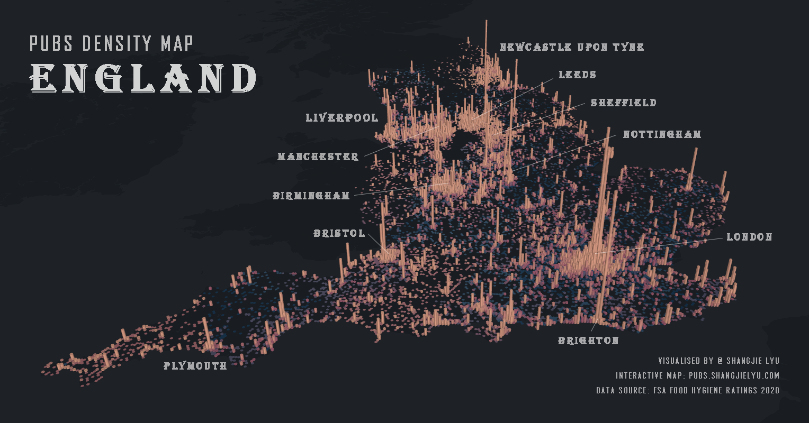

# Map Visualization

### *of geospatial density of the 43,772 pubs in England*

#### Interactive map is available at: https://pubs.shangjielyu.com/

---

### Data Sources

[1] [Open Pubs](https://www.data.gov.uk/dataset/87820f5d-d752-47d9-a22b-8fe88b2708f0/open-pubs-barnet-uk) by London Borough of Barnet (*[Open Government Licence](https://www.nationalarchives.gov.uk/doc/open-government-licence/version/3/)*)
